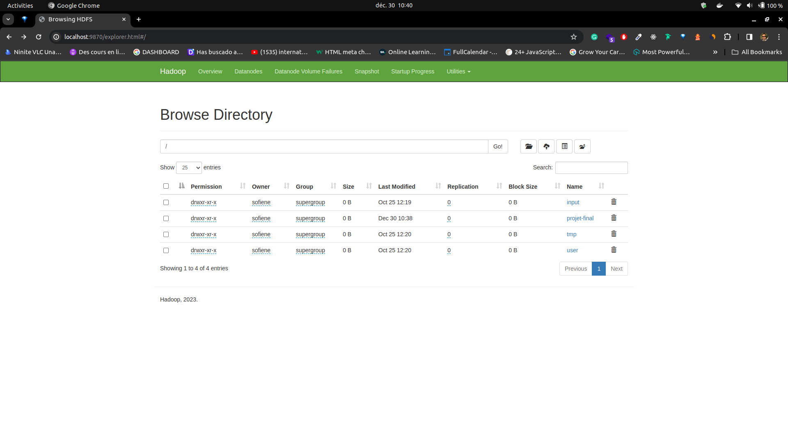
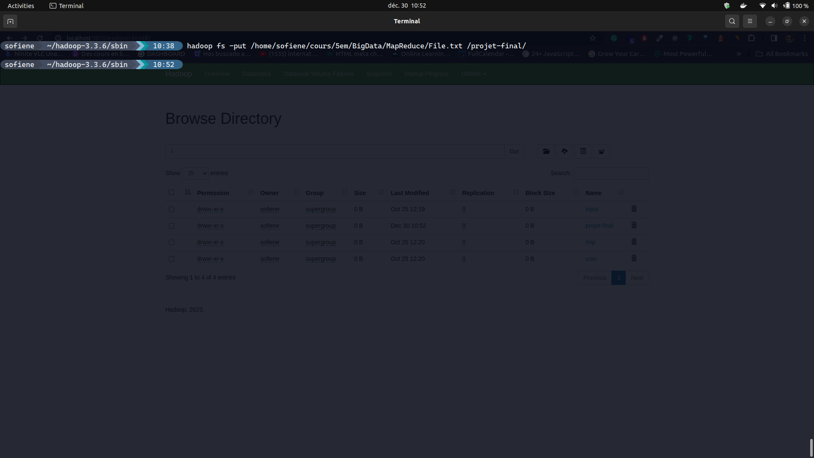
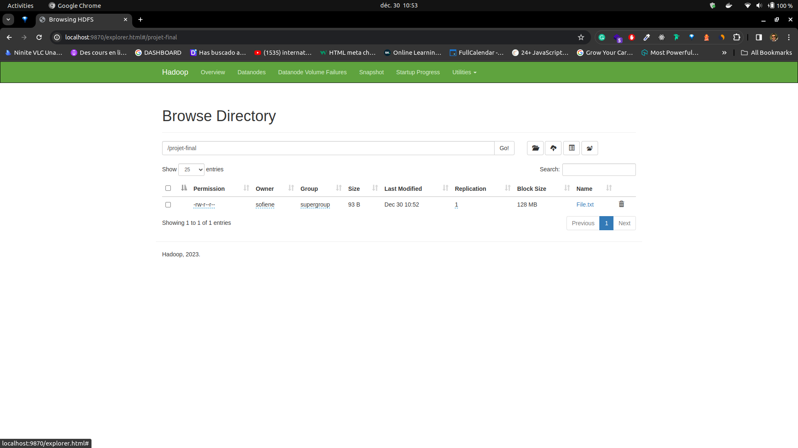
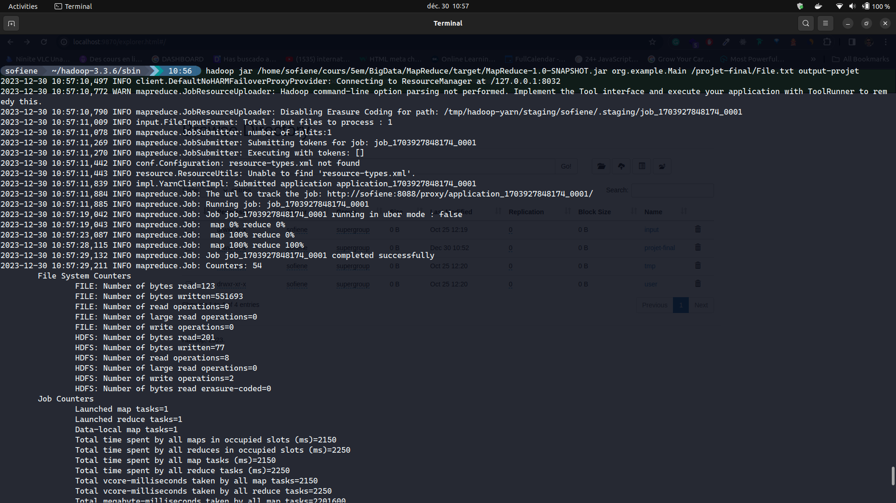
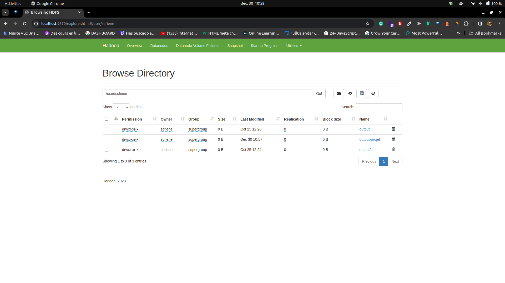
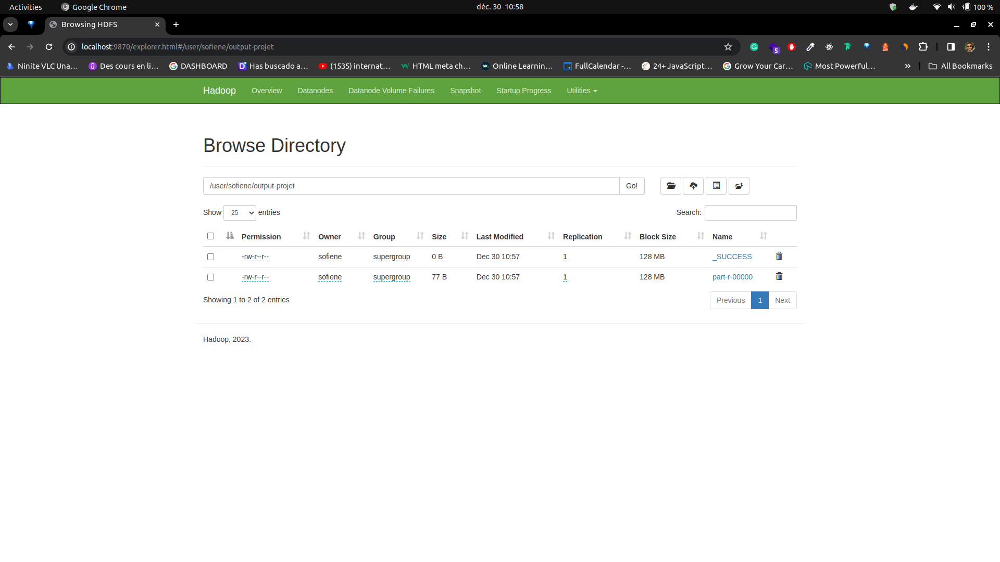
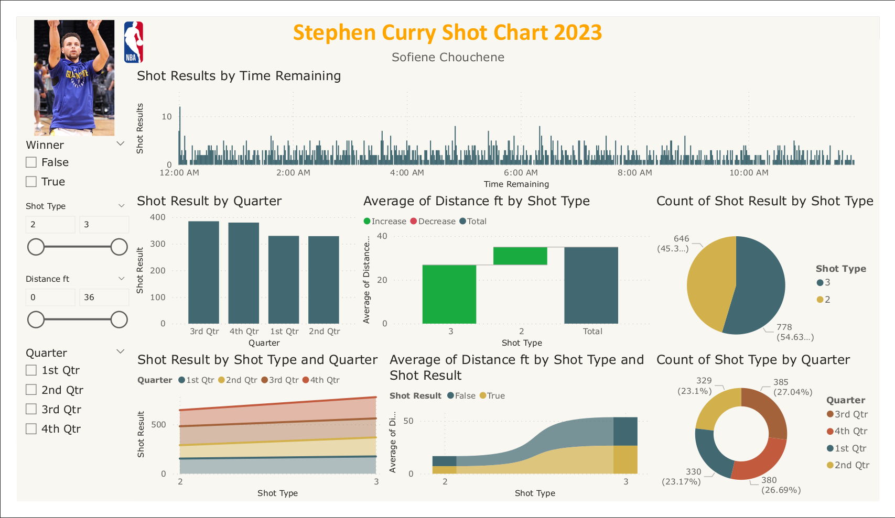

# HDFS-MAP-REDUCE-TALEND-POWER-BI

this project is devide in two part the first one is by using Hadoop map reduce and the second part is to data cleaning using talend and use that data in power BI
Thanks to M Boufares Nadia which has inspired and given us really good knowledge for setting up this project.

# Technologies

Hadoop-Map-Reduce : Used for distributed processing of large datasets.

Talend : Used for data integration and transformation in a unified and scalable platform.

POWER-BI: Used for business analytics and data visualization.

# 1- Map-reduce using hadoop

## Stage 1 :

Creating a new folder in haddop

```http
  hadoop fs -mdkir folder-name
```

example :


Result :



## Stage 2 :

After that we need to pass our input file in hadoop

```http
  hadoop fs -put file-in-your-pc /directory-in-hadoop/
```



Result :



## Stage 3 :

insert your java artifact that you create into hadoop to get executed in my case i create MapReduce File in this repo for word count using Java 17 and hadoop 3.3.6

```http
  hadoop jar jar-file-in-your-local your-project-Main input-in-hadoop output-in-hadoop
```

you should have this intl you have 100%Map 100%reduce

Result :



\*\*enter to your user/name in hadoop to see the output folder





# 2- Talned

In Talend i use Tmap to prepare my data and in the first one i use tFileOutPutDelimted to export data in csv file you can see it in folder Talend-DATAOUT


and for data warehouse i use tDBOutput to export my data in postgres


# 3- PowerBi

in powerBi we get our data that we prepare from talend and put in and create our Dashboard
you can take a look in my work in .pbix file in my repo


